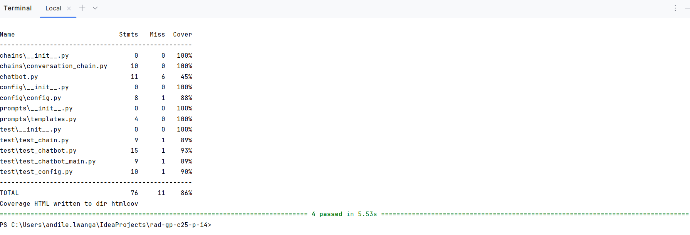

# RaD-GP-C25-P-I4: LangChain Chatbot with Session-Based Buffer Memory

## Project Requirements

The ask for the project **[RaD-GP-C25-P-I4]** was to conduct a focused research study on the LangChain framework, examining its core components, architecture, and value in building generative AI applications. This included exploring how LangChain enables modularity, prompt structuring, and memory integration. Building on that research, the second part involved implementing a functional chatbot that demonstrates context-aware, multi-turn interactions using `ConversationBufferMemory`. The final deliverables include a research summary, system architecture diagram, working codebase, and a live presentation showcasing both findings and the chatbot in action — all submitted in a structured GitLab project.

---

## Overview

This repository hosts a LangChain-based chatbot designed to maintain the conversational context during a single session using buffer memory. It uses LangChain’s modern `RunnableWithMessageHistory` abstraction with in-memory storage to simulate human-like dialogue continuity.

---

## Features

- Built using LangChain v0.2+
- Uses OpenAI GPT-3.5 via `langchain-openai`
- Maintains session-based buffer memory using `InMemoryChatMessageHistory`
- Modular architecture separating chain logic, configuration, and prompts
- Interactive CLI for local testing

---

## Architecture

### Session-Based Memory Strategy

| Component       | Role                                                |
|------------------|-----------------------------------------------------|
| `RunnableWithMessageHistory` | Wraps the chain and injects memory context |
| `InMemoryChatMessageHistory` | Stores dialogue only during runtime        |

```text
User Input ──▶ Prompt Template ──▶ LLM Response
                            ▲
                            │
               In-Memory Buffer (Session Context)
```

---

## File Structure

```bash
rad-gp-c25-p-i4/
├── chatbot.py                         # CLI entry point for chatbot execution
├── chains/
│   └── conversation_chain.py         # Core LangChain pipeline with memory integration
├── config/
│   └── config.py                     # Loads environment variables and validates API key
├── prompts/
│   └── templates.py                  # PromptTemplate for structured LLM input
├── test/
│   ├── test_chatbot.py               # Unit test for chatbot input/output
│   ├── test_chatbot_main.py          # Tests CLI integration with handle_query()
│   ├── test_chain.py                 # Validates end-to-end LangChain chain output
│   ├── test_config.py                # Tests API key loading from .env
│   ├── __init__.py
│   └── unit_test_screenshot.png      # Screenshot of passing test output (for report)
├── docs/
│   ├── langChain_Framework_Research.pdf  # Formal write-up of LangChain research
│   └── architecture.png                  # Visual diagram of LangChain system flow
├── requirements.txt                  # All required packages for environment setup
├── README.md                         # Project summary, setup, usage, and test guide
├── project_reference.txt             # Reference ID for project submission
├── .env                              # Environment variables (e.g., OpenAI API key)
├── .gitignore                        # Git exclusions
└── .coverage                         # Generated test coverage metadata

```

---

## Setup Instructions

### 1. Install Dependencies

```bash
pip install -r requirements.txt
```

### 2. Configure Environment

Create a `.env` file at the root with:

```env
OPENAI_API_KEY=your-api-key-here
```

### 3. Run the Application

```bash
python chatbot.py
```

---

## Example Interaction

```text
You: My name is Michael.
Bot: Nice to meet you, Michael.

You: What's my name?
Bot: Your name is Michael.
```

Note: Memory is retained during the session only. Once the application is closed, history is reset.

---

## Testing

Run the included test suite:

```bash
pytest test/
```
---
### Coverage Report


## Documentation

Refer to:
- `docs/langChain_Framework_Research.pdf` for the formal research document
- `docs/architecture.png` for a visual of system flow

---


---
